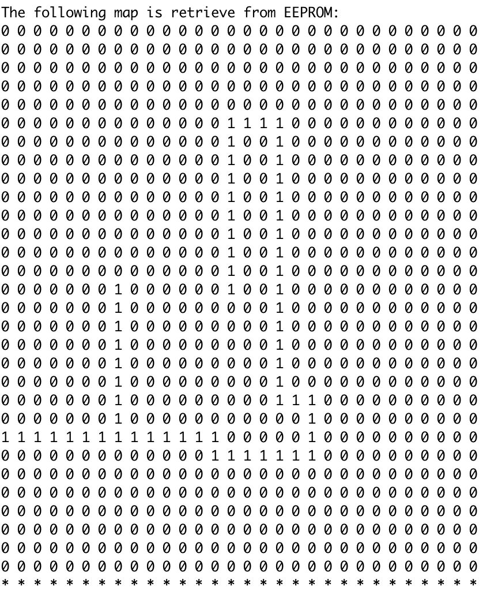

# Edge Mapping Arduino Robot
This robot is able to trace out the boundaries of a surrounding, for example, the walls and output the map onto a computer.

# Getting Started
## Boards and Sensors
 - Arduino Uno.
 - Ultrasonic Sonic Sensor HC-SR04. 
   - Sensor 1, 2 and 3 is on port, front, starboard side respectively.
 - Arduino Motor Shield similar to model (L293) (SKU: DRI0001) with no brake control. 
   - Motor A and B is on port and starboard side respectively.
 - Wheel Encoders (SKU: SEN0038). 
   - Encoder A and B is attached to motor A and B respectively.
   
## Software
 - Arduino IDE
 
 
 
# Deployment
 1. Connect to computer and long press the pushbutton to initiate and reset the map in EEPROM.
 2. Place arduino car near a boundary. 
 3. Switch on the Arduino board and the motors. 
 4. Long press the pushbutton to begin mapping.
 5. Press pushbutton when arduino car is moving in a straight line after mapping is completed.
 6. Connect to computer to obtain map via EEPROM.
 

 
# Results
 '0' indicates free space while '1' indicates boundaries.

 

# Mechanism
## Moving
 This robot is following the boundaries using left-hand rule.
 - Is obstacle in front?
   - Yes: Turn right
   - No: Proceed checking
 - Is there free space at the left?
   - Yes: Turn left
   - No: Move forward at a distance from the boundaries at the left

## Mapping
 - Look up the direction the robot is facing via dead reckoning (North, South, East, West)
   - If robot turn left: change internal direction towards left (i.e. North to West) 
   - If robot turn right: change internal direction towards right (i.e. North to East)
   - If robot move forward: change '0' to '1' in previous position
 
